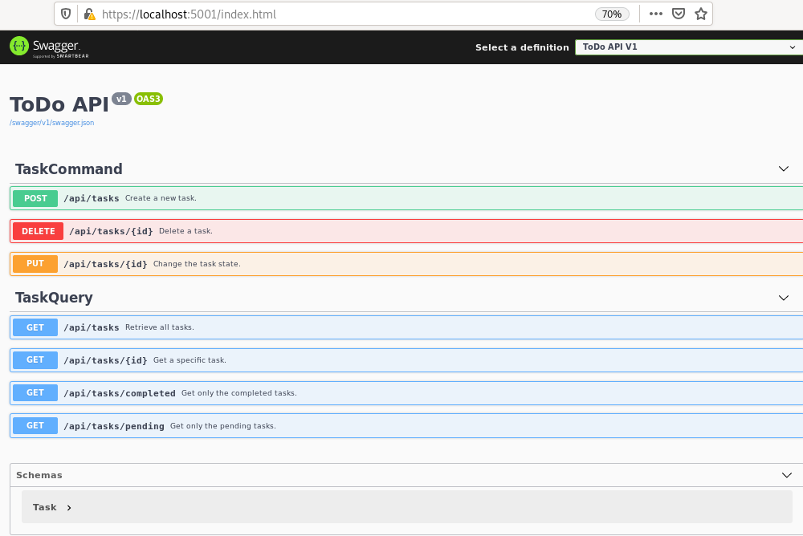

# Gandalf's ToDo Lista
ToDo Restful api (.net core) and SPA client (React)

## How long did you spend on your solution?
I spent 8h.

## How do you build and run your solution?
There are 3 folders with 3 projects developed in Visual Studio Code under Linux operating system (Fedora 31 distribution).
 1. ToDo.Api contains the backend .net core 3.0 restful API.
 2. Todo.Api.Tests contains the API tests.
 3. todo-react-app contains the frontend SPA client.

### 1. .net core API
Open Ciklum folder and press F5 to select the net core project. Web browser will open at url https://localhost:5001/index.html and you'll see the OpenApi specification (swagger)

### 2. API tests project
Tests are located at Services folder. There are a Folder by each service and a class by method. To run tests, open any test class and press Run link
[Tests](./images/test.png)

### 3. SPA
At todo-react-app folder, execute the command yarn start. Web browser will open at url http://localhost:3000/
[React](./images/test.png)

## What technical and functional assumptions did you make when implementing your solution?
I use the latest stable version of .net core 3.0 and Linux OS as developing platform. To persistence layer I use InMemoryDatabase; it's a not a relational database but it let us write Linq sentences and to take advantage of repository pattern (it's based in Entity Framework)
The API endpoints are documented with openAPI (aka swagger). You can see /// comments at the top of each controller method to expose in api documentation (description, status code, etc)
The test are developed with xUnit and FluentAssertions to be the asserts more readable.
The SPA client use two packages to call the api (axios) and manage objects state(immutability-helper)

## Explain briefly your technical design and why do you think is the best approach to this problem.
The api controllers are little and without business logic inside them. There are two controllers: one for read operations and another one for update database. It's a good start point to scale the solution to microservices and CQRS pattern. All the logic is outside the controllers, it's in service layer. The service are injected inside the controllers constructor.

I liked to follow the *Tell, Don’t Ask* principle (Demeter's Law) and I implemented it in the Task object (function *public Task ToggleState()*) Also, with differents models for presentation and database I could mark the setters methods as private (avoiding the antipattern public setters), and write named constructor instead of the default one.

To avoid CORS troubles I enabled it in backend only for localhost. Other solutions solved that allowing all headers, origins,.. It's highly unsecure.

## If you were unable to complete any user stories, outline why and how would you have liked to implement them.

I would have liked:
 - to write a viewmodel instead of return to the client the database one (You can see an example about that in the branch *separated-model* in API local git repository)
- to split the todocomponent in the SPA in some components to better reuse.
- to move the components function to a react service class for example in a generic api consumer class with common methods like get, post, delete,... (someone like [this](https://github.com/dotnet-architecture/eShopOnContainers/blob/dev/src/Web/WebSPA/Client/modules/shared/services/data.service.ts))
- to write test for React application but I never worked with React before :-)